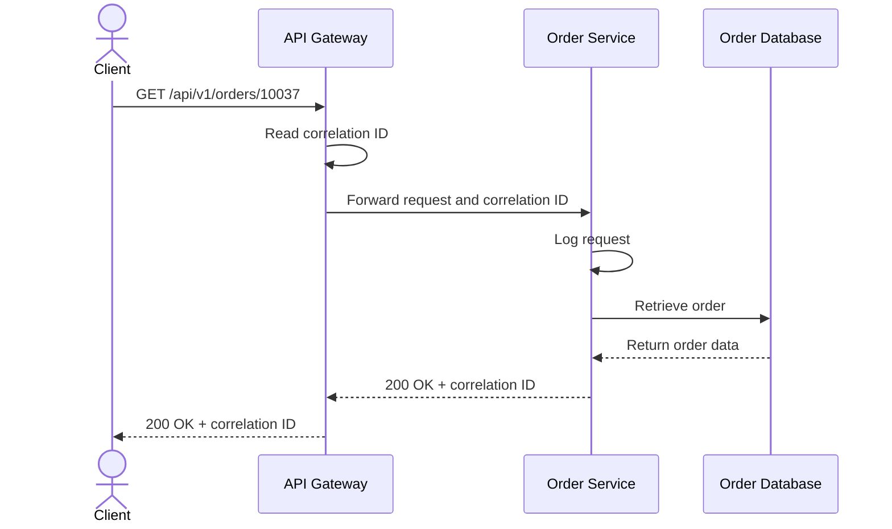
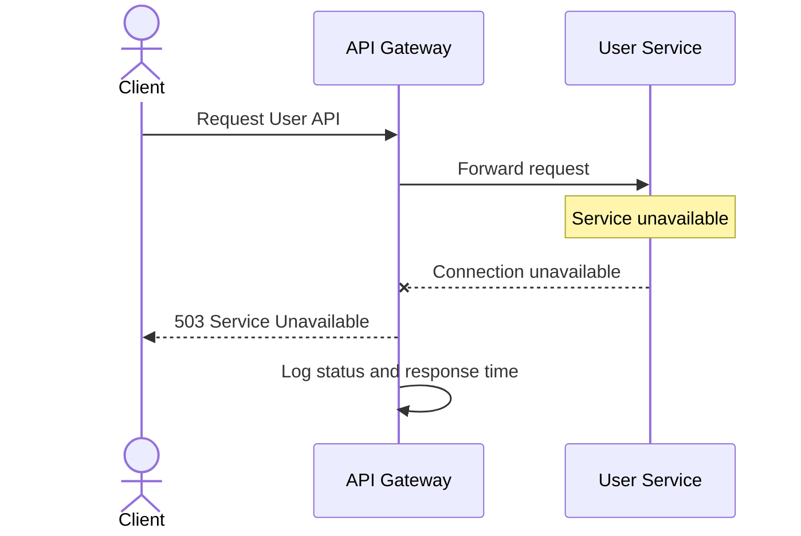
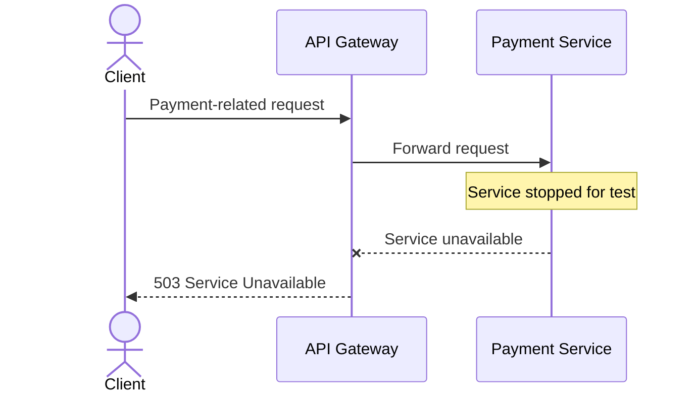

# JIRA Task 05 — Sequence Diagrams

## 1. Successful API Request

## 2. User Service Unavailable

## 3. Payment Service Unavailable

**Test note:** The User Service and Payment Service failure tests