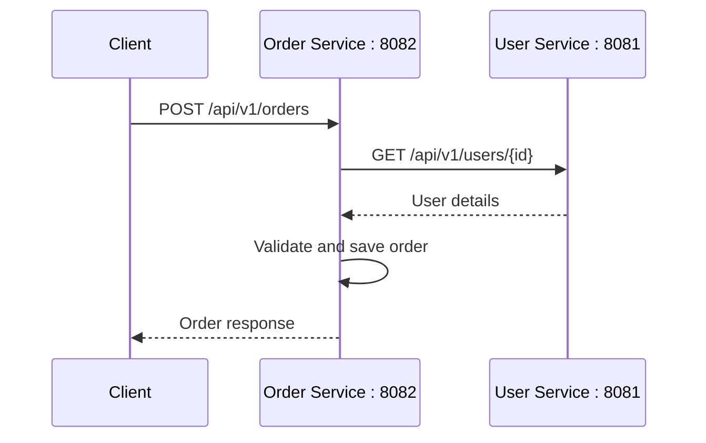
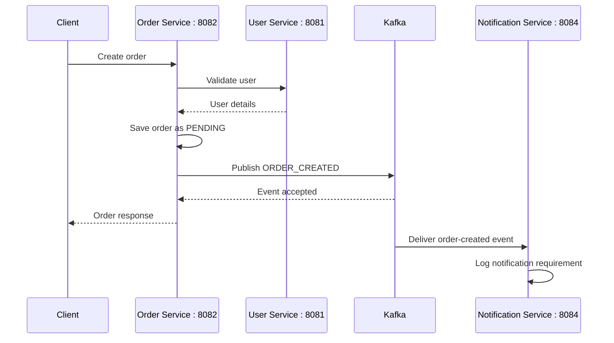

# JIRA TASK 04 — Inter-Service Communication, Resilience & Kafka

## Task Overview

**Date:** 21-Sep-2026 to 25-Sep-2026  
**Duration:** 5 working days / 40 hours  
**JIRA Tasks:** 5 × 8 hours  
**Status:** Completed for the implemented and tested scope

### Objective

Implement service-to-service communication between User Service and Order Service, add timeout/retry/circuit-breaker handling, and implement asynchronous Kafka messaging between Order Service and Notification Service.

---

## 1. Service Architecture

The implemented flow contains the following services:

| Service | Port | Responsibility |
|---|---:|---|
| User Service | 8081 | Provides user information through REST APIs |
| Order Service | 8082 | Creates and manages orders; calls User Service; publishes Kafka events |
| Notification Service | 8084 | Consumes `order-created` Kafka events and logs notification requirements |
| Eureka Server | 8761 | Service discovery for inter-service communication |
| Kafka | 9092 | Asynchronous event messaging |

Order Service uses OpenFeign for REST communication with User Service and Resilience4j circuit breaker handling. Kafka is used to decouple order creation from notification processing.

---

## 2. JIRA-01 — REST Service-to-Service Communication

### Implementation

User Service exposes:

```text
GET /api/v1/users/{id}
```

Order Service communicates with User Service through an OpenFeign client.

Example request:

```text
GET http://localhost:8081/api/v1/users/1
```

Example response used during testing:

```json
{
  "id": 1,
  "name": "Alex Mercer",
  "email": "alex.mercer@example.com",
  "phone": "9876543210"
}
```

Order creation validates the user before saving the order.

### Order Flow



### Failure Handling

When User Service communication fails, the Order Service uses the configured fallback/circuit-breaker flow instead of continuing as though the user was successfully validated.

---

## 3. JIRA-02 — Timeout, Retry and Failure Handling

The Order Service Feign client configuration includes:

```yaml
openfeign:
  client:
    config:
      user-service:
        connectTimeout: 3000
        readTimeout: 5000
```

### Timeout Configuration

- Connection timeout: **3000 ms**
- Read timeout: **5000 ms**

These settings prevent the Order Service from waiting indefinitely for User Service responses.

### Failure Behaviour

When the downstream User Service cannot be reached successfully, the Order Service records the failure and moves to its configured resilience/fallback handling.

---

## 4. JIRA-03 — Circuit Breaker and Fallback

Resilience4j circuit breaker configuration used for the User Service call:

```yaml
resilience4j:
  circuitbreaker:
    instances:
      UserClientgetUserByIdLong:
        failureRateThreshold: 50
        minimumNumberOfCalls: 5
        slidingWindowSize: 5
        slidingWindowType: COUNT_BASED
        waitDurationInOpenState: 10s
        permittedNumberOfCallsInHalfOpenState: 2
```

### Circuit Breaker States

```text
CLOSED
   |
   | failure rate reaches threshold
   v
OPEN
   |
   | wait duration expires
   v
HALF_OPEN
   |
   | successful test calls
   v
CLOSED
```

### Fallback

The User Client contains a fallback path for failed User Service calls. During testing, the fallback logged:

```text
Circuit Breaker fallback triggered for userId=1
```

The API then returned a controlled failure instead of pretending that the user lookup succeeded.

---

## 5. JIRA-04 — Kafka Asynchronous Messaging

### Kafka Setup

Kafka **4.1.2** was configured locally in WSL.

Broker address used by the Windows Spring Boot services:

```text
192.168.177.99:9092
```

Kafka storage was configured using:

```text
/home/shivakumar/kafka-data
```

### Topic

Topic created:

```text
order-created
```

Topic verification:

```text
PartitionCount: 1
ReplicationFactor: 1
Leader: 1
Isr: 1
```

### Event Payload

Order Service publishes the following event structure:

```json
{
  "orderId": 501,
  "userId": 101,
  "amount": 50000,
  "eventType": "ORDER_CREATED"
}
```

The actual recovery test later used `orderId: 7`.

### Producer

Order Service publishes the event after successfully saving the order.

Conceptual flow:

```text
Order Service
     |
     | publish ORDER_CREATED
     v
Kafka topic: order-created
```

### Consumer

Notification Service listens to:

```text
order-created
```

Consumer group:

```text
notification-service-group
```

The consumer logs the order information and the notification requirement.

### Asynchronous Flow



---

## 6. Kafka Failure-Recovery Test

This was the final required failure scenario for JIRA-04.

### Test Steps

1. Kafka was running.
2. Eureka, User Service and Order Service were running.
3. Notification Service was stopped.
4. An order was created through Postman.
5. The order was successfully created with **Order ID 7**.
6. Notification Service was started again.
7. Kafka delivered the previously published event to Notification Service.

### Order Creation Result

```json
{
  "id": 7,
  "userId": 1,
  "productName": "Laptop",
  "quantity": 2,
  "amount": 50000,
  "status": "PENDING"
}
```

### Notification Service Recovery Log

```text
Order created: orderId=7, userId=1, amount=50000, eventType=ORDER_CREATED
User notification required
```

### Result

The failure-recovery test was successful. The Notification Service was unavailable when the order was created, but after the Notification Service restarted, the Kafka event was consumed successfully.

---

## 7. JIRA-05 — Complete End-to-End Workflow

The implemented end-to-end workflow is:

```text
Client
  |
  v
Order Service (8082)
  |
  +---- REST ----> User Service (8081)
  |
  +---- Kafka ---> order-created topic
                       |
                       v
              Notification Service (8084)
```

### Complete Order Flow

```text
1. Client sends create-order request.
2. Order Service validates the user using User Service.
3. Order Service saves the order.
4. Order Service publishes ORDER_CREATED to Kafka.
5. Notification Service consumes the event.
6. Notification Service logs the order and notification requirement.
```

### Failure Flow

```text
Notification Service DOWN
          |
          v
Order Service creates order
          |
          v
Kafka stores/delivers event later
          |
          v
Notification Service restarted
          |
          v
Event consumed successfully
```

---

## 8. Technologies Used

- Java 17
- Spring Boot 4.1.1
- Spring Cloud OpenFeign
- Eureka Service Discovery
- Resilience4j Circuit Breaker
- Spring Kafka
- Apache Kafka 4.1.2
- PostgreSQL
- Postman
- WSL Ubuntu

---

## 9. Verification Summary

| Area | Verification |
|---|---|
| User Service REST API | Verified `GET /api/v1/users/1` |
| Order Service | Started successfully on port 8082 |
| REST inter-service call | User validation through Order Service verified |
| Timeout configuration | 3s connect / 5s read configured |
| Circuit breaker | Fallback behaviour observed during downstream failure |
| Kafka broker | Running on `192.168.177.99:9092` |
| Kafka topic | `order-created` created and described successfully |
| Kafka producer | Order Service publishes event |
| Kafka consumer | Notification Service consumes event |
| Failure recovery | Order 7 consumed after Notification Service restart |

---

## 10. Conclusion

Task 04 implemented REST-based service communication, resilience controls, and asynchronous Kafka messaging across the microservices. The end-to-end flow and the required Notification Service failure-recovery scenario were successfully tested.
